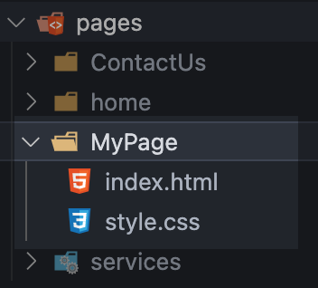

# Quick Start

## Table of Contents

- [Quick Start](#quick-start)
  - [Table of Contents](#table-of-contents)
  - [Prerequisites](#prerequisites)
  - [Init project](#init-project)
  - [Start development environment](#start-development-environment)
    - [Using Browser Sync](#using-browser-sync)
    - [Using Live Server](#using-live-server)
  - [CLI Tool](#cli-tool)
  - [Add component](#add-component)
  - [Add page](#add-page)
  - [Production build](#production-build)
  - [Components](#components)
    - [Composition](#composition)
    - [Props](#props)
    - [Content](#content)
  - [Assets](#assets)

## Prerequisites

Applications:

- NodeJS LTS version (https://nodejs.org/en/)
- VS Code (https://code.visualstudio.com/download)

_NOTICE: Don't forget to add all applications to PATH variable during the installation._

## Init project

Copy project from git https://github.com/buaa00/lsf-boost


Start the VS Code inside cloned project and open up the terminal by clicking `View > Terminal` in the menu bar or using hotkey `Ctrl+~`.


Run following commands:

- To install all necessary modules

```console
npm install
```

- To install all necessary VS Code extensions

```console
npm run init-ide
```

## Start development environment

In the project terminal run

```console
npm run dev
```

To stop the development environment press `Ctrl+C` in running terminal or kill the whole terminal from VS Code.


### Using Browser Sync

The browser should start on address `http://localhost:3000`

To open one of the pages add path to the page folder in the link `http://localhost:3000/pages/home`

### Using Live Server

Alternate way to run open one of the pages is to serve them using _LiveServer_ plugin for VS Code.


_NOTICE: It's up to you what variant will you choose_

## CLI Tool

You can use CLI Tool to boost your productivity.

```console
npm run cli -- -h
```

## Add component

To add new component(only HTML and CSS) using CLI tool run the following command in the terminal

```console
npm run cli -- -c My-Component --no-script
```

The result should be component `My-Component` placed under `./components/My/Component` folder.


This command creates folder structure and default files for specified component name.

Using CLI Tool is optional, new component can also be done manually by creating following folder and file structure:

- `./components/My/Component` - component directory(defines components name _My-Component_) **_required_**
- `./components/My/Component/index.html` - the HTML structure of the every component **_required_**
- `./components/My/Component/style.css` - the CSS styles for defining component look **_optional_**
- `./components/My/Component/script.js` - the JS script for definig component interactive behaviour **_optional_**

## Add page

To add new page(only HTML and CSS) using CLI tool run the following command in the terminal

```console
npm run cli -- -p MyPage --no-script
```

The result should be page `MyPage` placed under `./pages/MyPage` folder.



Try visiting this page on <a href="http://localhost:3000/pages/MyPage" target="_blank">http://localhost:3000/pages/MyPage</a>

This command creates folder structure and default files for specified page name.

Using CLI Tool is optional, new component can also be done manually by creating following folder and file structure:

- `./pages/MyPage` - page directory(defines page name _MyPage_) **_required_**
- `./pages/MyPage/index.html` - the HTML structure of the every page **_required_**
- `./pages/MyPage/style.css` - the CSS styles for defining page look **_optional_**
- `./pages/MyPage/script.js` - the JS script for definig page interactive behaviour **_optional_**

## Production build

_NOTICE: To follow this step, development environment must be stopped!_

Run following commands:

- To build pages for production usage

```console
npm run build
```

- To generate SEO reports for built pages

```console
npm run seo-reports
```

## Components

### Composition

As defined components are composed of:

- index.html (_required_)
- style.css (_optional_)
- script.js (_optional_)

Let's use component named [Common-Info-Box](components/Common/Info/Box) for our example.

HTML part:

```html
<section class="common-info-box container">
  <a href="tel:(253) 616-4991"
    ><i class="fas fa-phone-alt"></i> (253) 616-4991</a
  >
  <a href="mailto:info@somedomain.com"
    ><i class="fas fa-envelope"></i> info@somedomain.com</a
  >
</section>
```

CSS part:

```css
.common-info-box a {
  color: aliceblue;
  text-decoration: none;
  margin-left: 20px;
}

.common-info-box a:nth-child(1) {
  margin-left: 0;
}

.common-info-box a:hover {
  color: aliceblue;
  text-decoration: underline;
}
```

### Props

Props are way to propagate generic data to component HTML. Example of using props:

```html
<section class="common-info-box container">
  <a href="tel:{{phone}}"><i class="fas fa-phone-alt"></i> {{phone}}</a>
  <a href="mailto:{{mail}}"><i class="fas fa-envelope"></i> {{mail}}</a>
</section>
```

And when this component is needs to be displayed we add 2 prop values.

```html
<Common-Info-Box
  lb-props-phone="(253) 616-4991"
  lb-props-mail="info@somedomain.com"
></Common-Info-Box>
```

Note that filed we used eariler in HTML `{{phone}}` is propagated to `Common-Info-Box` component by adding `lb-props-phone` attribute. So prefix for sending prosp to component is `lb-props-`;

Prop naming must follow

- follow snake case syntax in HTML (example: `lb-props-info-email`)
- in rendering use same syntax (example: `{{info-email}}`)
- props should only contain letters and numbers

### Content

Content is way to render anything that is passed to component as children.

We can modify our `Common-Info-Box` to see what will happen.

```html
<section class="common-info-box container">
  <a href="tel:{{phone}}"><i class="fas fa-phone-alt"></i> {{phone}}</a>

  {{{lbContent}}}

  <a href="mailto:{{mail}}"><i class="fas fa-envelope"></i> {{mail}}</a>
</section>
```

We added `{{{lbContent}}}`(_note that it's surrounded by triple {}_) in between two existing links. Let's try to pass some children to this component.

```html
<Common-Info-Box
  lb-props-phone="(253) 616-4991"
  lb-props-mail="info@somedomain.com"
>
  <h1>PUT ME AT THE END</h1>
</Common-Info-Box>
```

## Assets

Assets represent all static content of website used for visualisation and interactivness(css, js, images, videos, sounds, ...).

> _NOTICE: CSS and JS used in components are automatically generated by lsf-boost_

You're free to import any additional asset to your project and you can link it by using absolute path from the project root:

```html
<link rel="stylesheet" href="/assets/css/home.css" />

```

Improtant assets:

- [global.css](/assets/css/global.css) - Used for defining theme settings
- [lsf-boost.js](/assets/js/lsf-boost.js) - Core of lsf-boost rendering process
